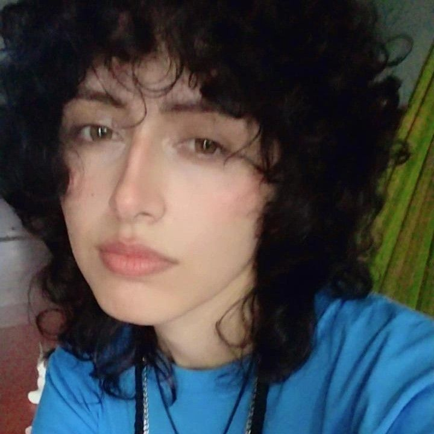
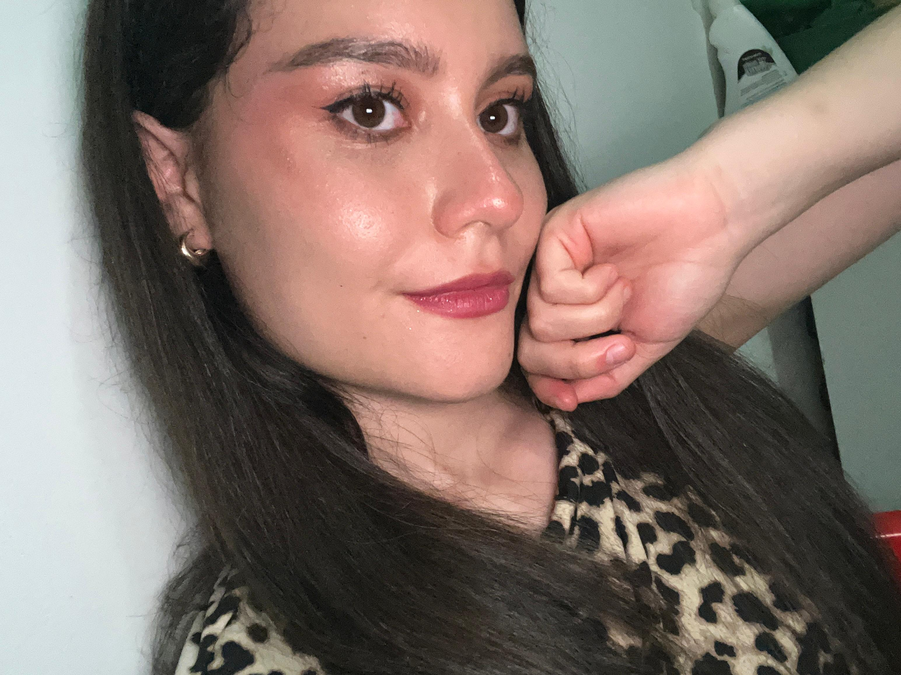

# Equipo: 19_PANTERAS_VALIENTES

## Presentaciones

### Julián David Salamanca Marroquín

- **Rol de la industria:** Gestor del repositorio
- **Ubicación:** San José del Guaviare, Colombia
- **Perfil breve:** Estudiante de Ingeniería Multimedia. Me apasiona el mundo del anime y la lectura, especialmente los libros de misterio y fantasía. Soy alguien tímido al inicio, pero con el tiempo me gusta conversar y compartir de forma alegre. Sueño con terminar mi carrera y fundar una agencia de diseño gráfico para ayudar a otros creativos a crecer y encontrar su lugar en el mercado.

### Sharon Stefani Henao Caceres

- **Rol de la industria:** Diseñador UX/UI.
- **Ubicación:** Restrepo, Meta.
- **Perfil breve:** Soy estudiante de Ingeniería Multimedia de 7mo semestrepo. Elegí esta carrera porque siempre he sido una apasionada de los videojuegos, la animación y la creación de contenidos interactivos. Estoy en constante aprendizaje para fortalecer mis habilidades en programación, arte digital y gestión de proyectos dentro de la industria creativa.

### Laura Camila Ruiz Medina

- **Rol de la industria:** QA Tester
- **Ubicación:** Tauramena, Casanare.
- **Perfil breve:** Actualmente estudio Ingeniería Multimedia y curso el séptimo semestre. Me gustan los animales, leer libros de superación personal y siempre busco aprender y crecer tanto a nivel personal como profesional.